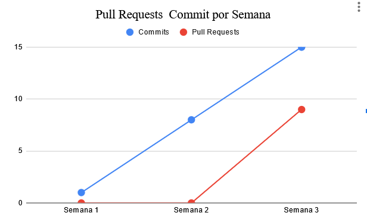
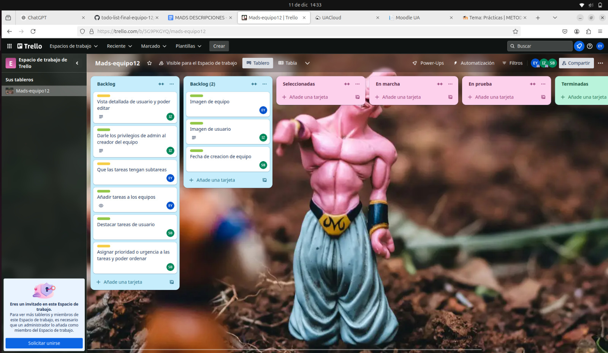
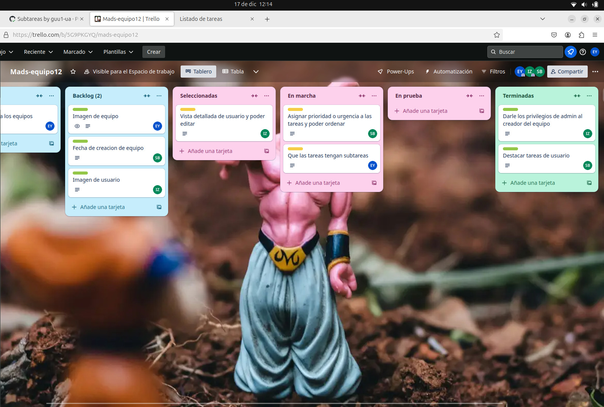
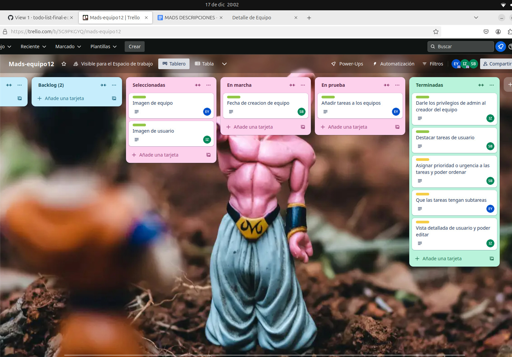
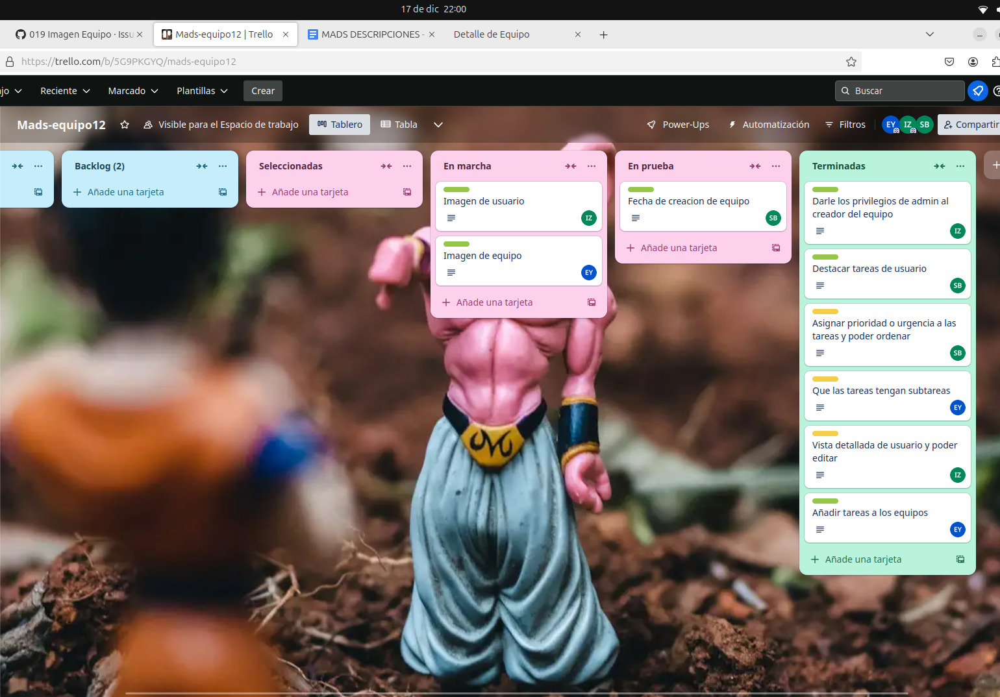
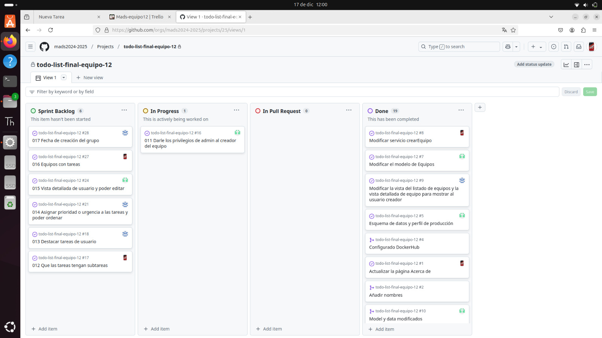
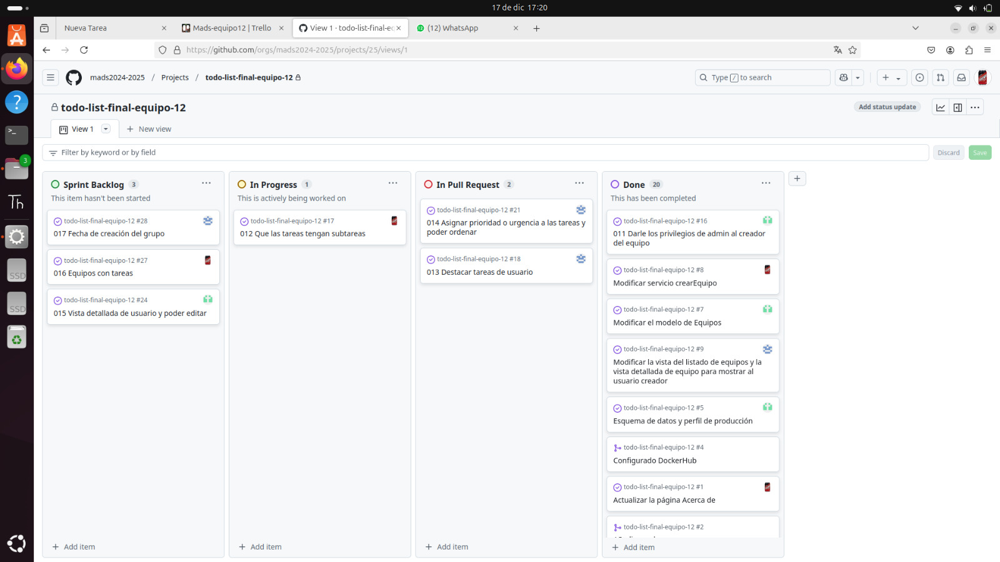
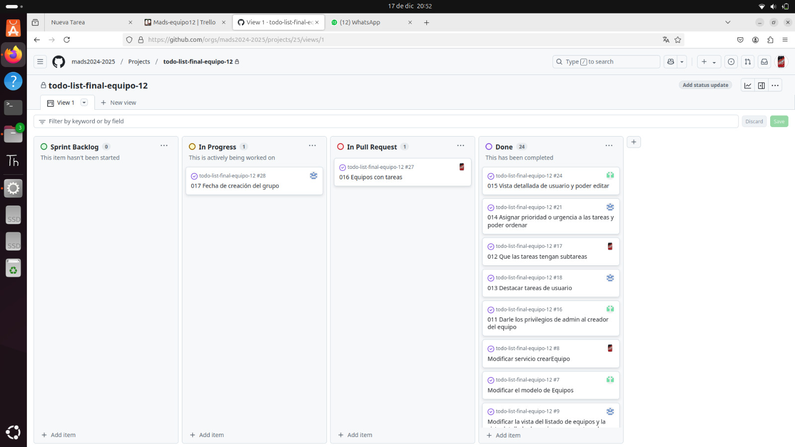
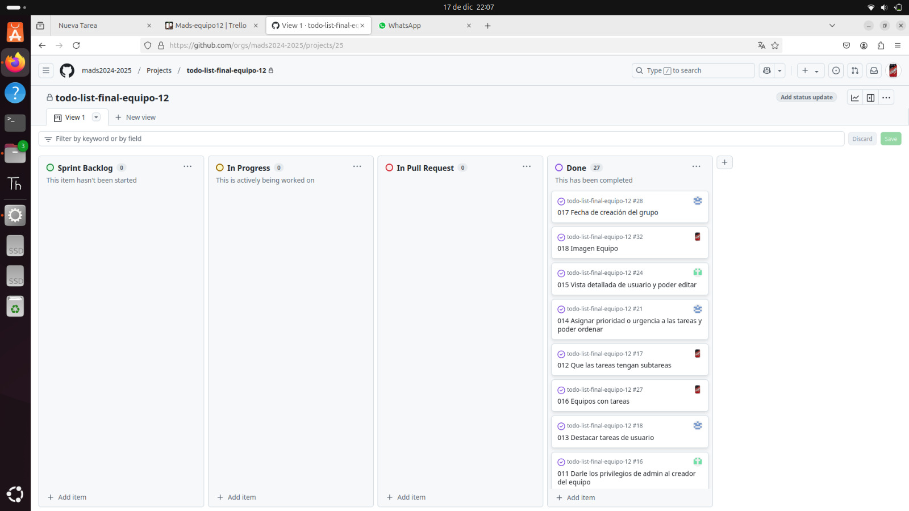

**Documentación practica 5.**

### Versión 1.4.0
En esta práctica hemos implementado una serie de funcionalidades clave para mejorar la gestión de usuarios, equipos y tareas dentro del sistema.
El objetivo principal ha sido proporcionar una experiencia de usuario más rica y eficiente, incorporando elementos como la edición de perfiles, 
administración avanzada de equipos y herramientas para la priorización y organización de tareas.

# **Funcionalidades Implementadas**

## **1. Vista detallada de usuario y edición de perfil**
- **Descripción para el usuario:**  
  Esta funcionalidad permite a los usuarios registrados acceder a una vista detallada de su perfil personal desde cualquier página de la aplicación. Desde esta vista, pueden consultar información como su nombre, correo electrónico y otros datos registrados. Además, incluye una opción para editar dicha información de forma sencilla y validada.

- **Descripción técnica:**  
  - Se creó una nueva vista asociada a la ruta `/perfil` que muestra la información del usuario almacenada en la base de datos.
  - Para la edición, se implementó un formulario en `/perfil` con la etiqueta POST, donde los usuarios pueden actualizar sus datos. Este formulario incluye validaciones tanto en el cliente como en el servidor, como:
    - Validación de campos obligatorios (nombre, correo electrónico, etc.).
    - Verificación del formato del correo electrónico.
  - **Backend:**
    - Se añadió un endpoint en el controlador correspondiente para gestionar la actualización de datos en la base de datos.
    - Se implementaron pruebas unitarias para garantizar que los datos incorrectos o incompletos no puedan ser guardados.

## **2. Privilegios de administrador para el creador del equipo**
- **Descripción para el usuario:**  
  Esta funcionalidad otorga automáticamente privilegios de administrador al creador de un equipo. El administrador tiene acceso exclusivo a herramientas de gestión, como la posibilidad de renombrar el equipo y expulsar a jugadores. Esto garantiza una gestión ordenada y controlada del equipo por parte de su creador.

- **Descripción técnica:**  
  - **Modelo de datos:** Se añadió una relación directa entre el equipo y su creador, permitiendo asignar automáticamente privilegios de administrador al usuario que crea un equipo.
  - **Interfaz de usuario:**
    - Se añadieron botones visibles solo para administradores, como:
      - Un botón para renombrar el equipo quree abre un formulario modal para cambiar el nombre.
      - Un botón para expulsar jugadores, que elimina al jugador seleccionado de la lista del equipo.
    - Estas herramientas están protegidas mediante permisos en el backend y solo son visibles para el administrador.
  - **Backend:**
    - Se añadieron verificaciones para validar que solo el creador del equipo pueda realizar ciertas acciones administrativas. Por ejemplo:
      - Al renombrar el equipo, se comprueba que el usuario autenticado sea el creador.
      - Al expulsar a un jugador, se verifica que el usuario tenga los permisos necesarios.
    - Se actualizaron las pruebas unitarias para garantizar la seguridad y funcionalidad de estas operaciones.

## **3. Destacar Tareas de Usuario**
- **Descripción para el usuario:**  
  Esta funcionalidad permite a los usuarios destacar tareas importantes en su lista para identificarlas rápidamente. Las tareas destacadas tienen un estilo visual diferente para diferenciarlas del resto.

- **Descripción técnica:**
  - **Modelo de datos:** Se añadió un atributo `destacado` al modelo de tareas para almacenar el estado de la tarea (destacada o no).
  - **Interfaz de usuario:**
    - En la lista de tareas, se añadió un botón que permite al usuario destacar o desmarcar una tarea.
    - Se aplicó un estilo visual específico a las tareas destacadas, como un color de fondo y un borde distintivo.
  - **Backend:**
    - Se implementaron servicios y controladores para gestionar las acciones de destacar y desmarcar tareas.
    - Se añadieron pruebas unitarias para garantizar que las tareas destacadas se almacenen y muestren correctamente.

## **4. Asignar Prioridad a las Tareas y Ordenación**
- **Descripción para el usuario:**  
  Esta funcionalidad permite asignar niveles de prioridad (alta, media, baja) a las tareas y ordenarlas según esta prioridad, facilitando la organización y planificación.

- **Descripción técnica:**
  - **Modelo de datos:** Se añadió un atributo `prioridad` al modelo de tareas, almacenando valores como "ALTA", "MEDIA" o "BAJA".
  - **Interfaz de usuario:**
    - Se añadió un selector en el formulario de tareas para que el usuario pueda asignar una prioridad al crear o editar una tarea.
    - En la lista de tareas, se incluyó un botón para ordenar las tareas según la prioridad asignada.
  - **Backend:**
    - Se implementaron servicios para asignar y actualizar la prioridad de las tareas.
    - Se añadieron métodos en los controladores para gestionar la ordenación de tareas por prioridad.
    - Se realizaron pruebas unitarias para verificar que las prioridades se asignan y ordenan correctamente.

## **5. Fecha de Creación de Equipos**
- **Descripción para el usuario:**  
  Los usuarios pueden visualizar la fecha de creación de un equipo en su vista de detalles. Esta información proporciona contexto sobre el historial del equipo.

- **Descripción técnica:**
  - **Modelo de datos:** Se añadió un atributo `fechaCreacion` al modelo de equipos. Este campo se genera automáticamente al momento de crear un equipo.
  - **Interfaz de usuario:**
    - En la vista de detalles del equipo, se añadió una sección para mostrar la fecha de creación en un formato amigable.
  - **Backend:**
    - Se incluyó el campo `fechaCreacion` en el DTO de equipos para su transferencia al frontend.
    - Se realizaron pruebas unitarias para garantizar que la fecha de creación se genere automáticamente y se muestre correctamente en todas las vistas relacionadas.

## **6. Subtareas para Tareas**

Descripción para el usuario: 
Esta funcionalidad permite a los usuarios registrados asociar subtareas a una tarea principal desde la vista '/tareas'. Las subtareas ayudan a desglosar una tarea compleja en pasos más pequeños, y cada tarea tendrá asociada una lista de subtareas. Los usuarios podrán crear y eliminar subtareas de manera sencilla.

- **Descripción técnica:**
  - **Base de datos:** 
    - Se creó una nueva tabla en la base de datos para almacenar las subtareas.
    - Creación de una relación "uno a muchos" entre tareas y subtareas en el modelo.
  - **Frontend:**
    - Se modificó la vista '/tareas' para incluir la lista de subtareas debajo del título de cada tarea principal.
    - Para la creación de subtareas, se implementó un formulario en '/subtareas/nueva'. Este formulario incluye validaciones en el cliente para:
      - Validación de que el campo 'nombre' no esté vacío.   
  - **Backend:**
    - Se añadió un endpoint en el controlador para gestionar la creación y eliminación de subtareas.
    - Se implementaron pruebas unitarias para garantizar que los datos incorrectos o incompletos no puedan ser guardados.
   
## **7. Tareas para equipos**

Descripción para el usuario: 
Esta funcionalidad permite a los usuarios que sean miembros o el creador de un equipo crear tareas asociadas a un equipo desde la vista '/equipos/{id_equipo}'. Estas tareas tendrán las mismas opciones que las tareas de usuario, pero estarán asociadas al equipo y serán visibles para todos los miembros del mismo.

- **Descripción técnica:**
  - **Base de datos:** 
    - Se modificó la tabla 'tareas' agregando un nuevo atributo equipo_id.
    - Se eliminó la restricción de NOT NULL en el atributo usuario_id para permitir tareas que no estén asociadas a un usuario individual.
    - Creación de una relación "uno a muchos" entre equipo y tareas en el modelo.
  - **Frontend:**
    - Se modificó la vista '/equipos/id_equipo' para incluir la lista de tareas debajo de la lista de usuarios.
    - Para la creación de tareas, se implementó un formulario en '/equipo/id_equipo/tareas/nueva'. Este formulario incluye validaciones en el cliente para:
    - Validación de que el campo 'titulo' no esté vacío.   
  - **Backend:**
    - Se añadió un endpoint en el controlador correspondiente para gestionar la creación de tareas asociadas a un equipo.
    - Se implementaron pruebas unitarias para garantizar que los datos incorrectos o incompletos no puedan ser guardados.

# **Puesta en producción**
La puesta en producción se ha realizado utilizando Docker y la base de datos de PostgreSQL, se ha subido el contenedor de la versión final de nuestra aplicación en: https://hub.docker.com/repository/docker/guu1/mads-todolist-equipo12/general siendo la versión final aquella que tiene como tag 1.4.0

Se realizaron pruebas de funcionalidad, autenticación y rendimiento para verificar el correcto funcionamiento de la aplicación, asegurándonos de que las nuevas funcionalidades implementadas funcionen correctamente.

# **Informe sobre la evolución del desarrollo**
El desarrollo del proyecto se llevó a cabo en un flujo estructurado basado en ramas específicas para cada funcionalidad. 
Durante las tres semanas de la práctica, trabajamos bajo la metodología de ramas individuales para cada tarea o funcionalidad,
integrándolas en la rama principal únicamente al finalizar el sprint. Esto permitió un control detallado de los cambios y una correcta 
revisión en equipo mediante Pull Requests.

Para la revisión y aseguramiento de la calidad del código, se dejaron abiertas las Pull Requests hasta la última semana del desarrollo, 
lo que permitió realizar revisiones cruzadas, resolver conflictos y garantizar que todas las funcionalidades fueran correctamente integradas.

A lo largo de las tres semanas, los commits reflejaron la evolución del proyecto. Aunque durante la primera semana la actividad en GitHub fue limitada, los esfuerzos se centraron en la configuración inicial, la organización del equipo y la selección de funcionalidades a implementar. En las semanas posteriores, aumentó la frecuencia y claridad de los commits, evidenciando avances significativos en el desarrollo de modelos, controladores, vistas, pruebas y la resolución de conflictos.

En resumen, este enfoque estructurado y colaborativo permitió mantener un desarrollo ordenado, asegurar la calidad del código y garantizar la estabilidad del sistema a medida que se integraban las distintas funcionalidades.

### Gráfica de Pull Requests y Commits por semana

La siguiente gráfica muestra el número de Pull Requests y commits realizados en cada semana del desarrollo:

Esta gráfica evidencia que el mayor volumen de Pull Requests se realizó en la última semana, al consolidar las funcionalidades implementadas en las ramas.
Sin embargo, las semanas anteriores estuvieron marcadas por un desarrollo activo en las ramas individuales y la implementación de funcionalidades, 
como destacan los commits realizados a lo largo del periodo.

La gráfica refleja la evolución del desarrollo del proyecto, mostrando cómo se distribuyó el trabajo entre las semanas y destacando el enfoque en la
revisión y fusión de ramas en la última etapa del sprint.

### Evolución del tablero Trello
1. 
2. 
3. 
4. 

### Evolución del tablero GitHub
1. 
2. 
3. 
4. 

# **Informe sobre las sesiones de Pair Programming**

Durante el desarrollo del proyecto, implementamos la metodología de Pair Programming en múltiples sesiones, tanto presenciales en clase como virtuales a través de Discord. Esta dinámica nos permitió colaborar de manera estrecha, rotando roles entre conductor (quien escribe el código) y copiloto (quien revisa, sugiere y toma notas). Esto fomentó un aprendizaje mutuo y nos ayudó a mantener un alto nivel de calidad en el código.

---

### Desarrollo de las sesiones

#### Sesiones en clase
- **Frecuencia:** Realizadas durante las clases de prácticas, con una duración de aproximadamente 2 horas por sesión.
- **Dinámica de roles:** Nos dividimos en parejas, rotando roles entre conductor y copiloto cada cierto tiempo para asegurar que todos contribuyeran de manera equitativa.
- **Tareas realizadas:**
  - Implementación de subtareas y asignar prioridad de las tareas.
  - Resolución de conflictos en merge requests.
  - Validación del cumplimiento de las condiciones de satisfacción de las historias de usuario mediante pruebas manuales y automáticas.
  
##### Sesión 1: Iker y Salma - Implementación de prioridad en las tareas

- **Desarrollo:**  
  Iker asumió el rol de copiloto y Salma como conductor inicialmente y fuimos rotando. En esta sesión, se trabajó en la lógica para asignar prioridades a las tareas en el backend y en el diseño de la interfaz que permitiera al usuario seleccionar dicha prioridad. Mientras Iker escribía el código, Salma identificó la necesidad de ajustar las validaciones en el modelo para evitar conflictos en los valores de prioridad.

- **Desafío:**  
  Durante las pruebas iniciales, se detectó que las prioridades no se estaban reflejando correctamente en la interfaz debido a un problema en la sincronización del frontend con el backend.

- **Resolución:**  
  Salma sugirió realizar una depuración paso a paso en la lógica del controlador, lo que permitió encontrar un error en la consulta SQL.

##### Sesión 2: Georg y Salma - Implementación de subtareas en las tareas

- **Desarrollo:**  
  Georg fue el conductor, mientras que Salma actuó como copiloto inicialmente. En esta sesión, se añadió la funcionalidad para que las tareas principales pudieran tener subtareas asociadas. Georg trabajó en la creación de las relaciones en la base de datos, mientras que Salma se encargó de diseñar la vista en la interfaz.

- **Desafío:**  
  Al integrar la funcionalidad, surgió un problema al intentar guardar subtareas con nombres duplicados.

- **Resolución:**  
    Georg propuso realizar una validación en el frontend y backend para garantizar la unicidad de los nombres. Esto se implementó de forma exitosa durante la misma sesión.

---

#### Sesiones en Discord
- **Frecuencia:** Realizada en un fin de semana, especialmente para resolver tareas pendientes fuera del horario de prácticas.
- **Dinámica:**
  - Uso compartido de pantalla, que permitió trabajar en tiempo real y visualizar los problemas directamente.
  - Resolución de errores encontrados en pruebas y ajustes finales en las vistas de usuario.
  - Integración de funcionalidades críticas, como la edicion de perfil, que requerían coordinación en la lógica del backend y la interfaz de usuario.

##### Sesión 3: Georg y Iker - Implementación de la edición de perfil

- **Desarrollo:**  
  Iker tomó el rol de conductor, mientras que inicialmente Georg actuó como copiloto. Durante esta sesión, se trabajó en la funcionalidad de edición de perfil, que incluyó la creación de un formulario interactivo para actualizar la información del usuario y su conexión con el backend para guardar los cambios.

- **Desafío:**  
  Durante las pruebas, se detectó que los cambios en el perfil no se reflejaban de inmediato en la interfaz debido a la falta de una actualización en tiempo real.

- **Resolución:**  
  Iker sugirió usar un enfoque basado en eventos para emitir una señal al frontend cada vez que se actualizara el perfil. Tras implementarlo, el problema quedó resuelto.

---

### Impresión sobre el Pair Programming

#### 🎓**Ventajas**
- **Fomentó el aprendizaje mutuo:**
  - Uno de los integrantes mejoró su comprensión de validaciones en el backend.
  - Otro aprendió técnicas para manejar conflictos en Git.
- **Detección de errores en tiempo real:**
  - Permitió identificar problemas rápidamente, evitando fallos críticos en etapas avanzadas.
- **Fortaleció la comunicación y cohesión del equipo:**
  - Aseguró que todos tuvieran un entendimiento compartido de los objetivos.

#### 🛠️**Desafíos**
- **Coordinación de horarios fuera de clase:**
  - Fue complicada, pero se resolvió con reuniones bien planificadas en Discord.
- **Subestimación de la complejidad inicial:**
  - Algunas tareas resultaron más difíciles de lo esperado, lo que alargó las sesiones.
  - Aprendimos a planificar mejor y valorar la importancia del rol de copiloto para detectar complicaciones.

#### 💡 **Conclusión**
 El uso de Pair Programming nos permitió:
- Mantener una calidad consistente en el código.
- Fomentar un aprendizaje colectivo.
- Mejorar la eficiencia en la resolución de problemas.

🎯 Aunque enfrentamos algunos retos, la experiencia fue enriquecedora y valiosa para futuros proyectos.

---

# **Resultado de la Retrospectiva**

Al final del sprint, realizamos una retrospectiva para evaluar lo que salió bien y los aspectos que podríamos mejorar en futuras prácticas o proyectos grupales. Este análisis nos permitió reflexionar sobre el proceso y sentar las bases para un trabajo más eficiente y coordinado en el futuro.

#### **¿Qué ha ido bien en el sprint?**

- **Colaboración del equipo:**
  La estrategia de trabajar por ramas específicas para cada funcionalidad ayudó a distribuir de manera equitativa las tareas y evitar interferencias en el código.
  Cada miembro pudo enfocarse en las tareas asignadas sin retrasar el progreso general del proyecto.

- **Integración y revisión final:**
  Los Pull Requests abiertos permitieron realizar revisiones detalladas antes de integrar cambios en la rama principal. Esto mejoró la calidad del código y evitó errores críticos.
  La resolución de conflictos durante el merge fue manejada eficazmente en equipo.

- **Cumplimiento de objetivos:**
  Logramos implementar las funcionalidades planificadas.

#### **¿Qué se podría mejorar en el siguiente sprint?**

- **Mayor uso de herramientas de gestión:**
  Aunque utilizamos tableros para organizar las tareas, el seguimiento diario podría ser más riguroso para detectar bloqueos o retrasos a tiempo.
  Integrar métricas automáticas o notificaciones para visualizar el progreso en tiempo real.

- **Sincronización en las sesiones de Pair Programming:**
  En ocasiones, los horarios de los integrantes complicaron la realización de sesiones compartidas fuera de clase.
  Se podría establecer un cronograma fijo desde el inicio del sprint para garantizar la disponibilidad.

---
